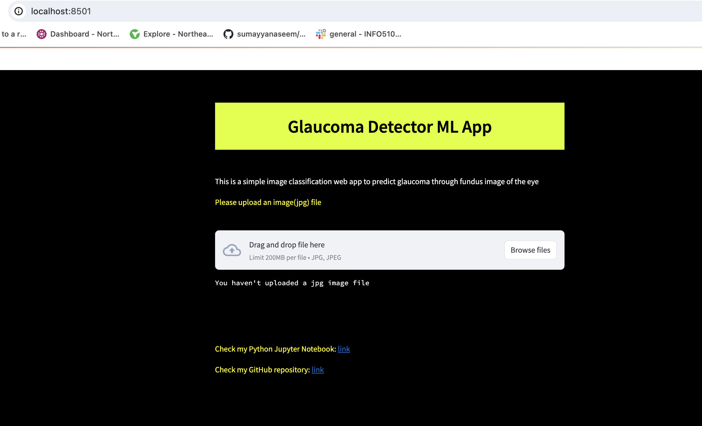
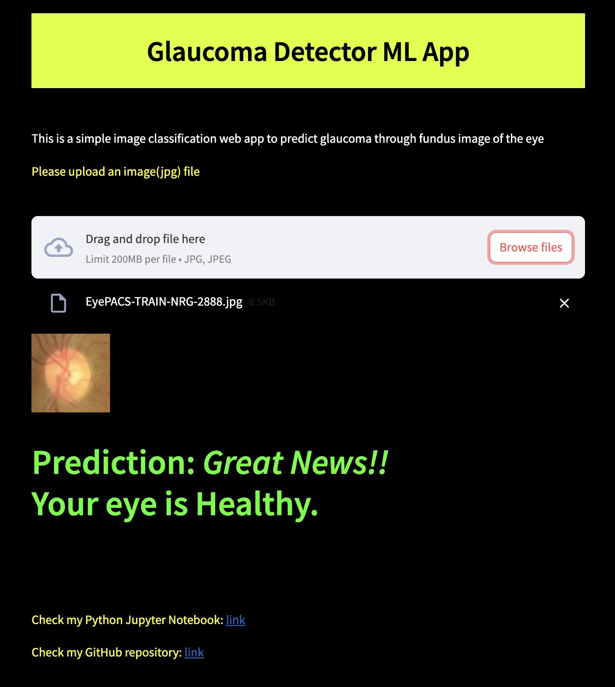
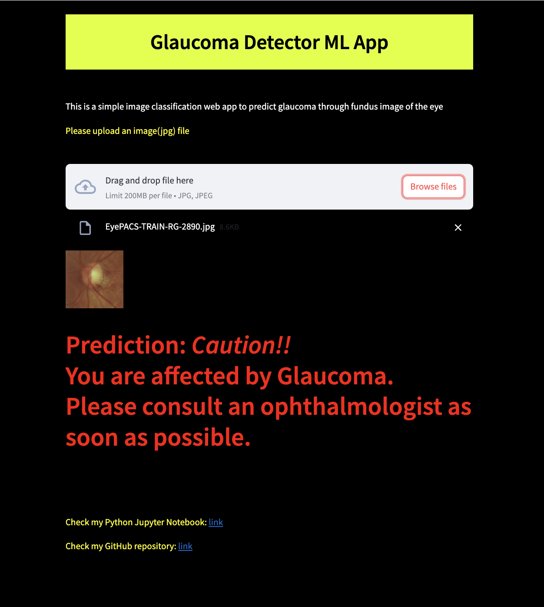

# Glaucoma detector ML APP

## Web Page



## Healthy Eye or Non - Referable Glaucoma which does not need doctor's consultation



## Referable Glaucoma or Glaucomatous Eye




# Details

## About Dataset
* Collected all the publicly available labelled(RG and NRG) retinal scan of eye from Kaggle.
* Dataset is available: https://www.kaggle.com/datasets/deathtrooper/glaucoma-dataset-eyepacs-airogs-light-v2/data
* Images are full retinal scan of eye. So, we cropped the full fundus images too. See below.
* The dataset is divided into 3 parts: train, test, and validation set.
* These sets are in the approximate ratio of 21:2:2 or 4000 (~84%), 385 (~8%), and 385 (~8%) for train, test, and validation sets.
* Finally, sticked with 9540 total images with 4770 images in each classes.


## About model
* Saved all these images to my local system and trained on various CNN architectures from simple to advanced.
* Augmentated data using keras ImageGenerator to cut down high variance. But there is some bias due to low and bad data.
* Used keras (3.2.1) and tesorflow (2.16.1) on top of python (3.11.5).
* Trained on train set and validated on validation set after each epoch. Finally tested the test set.
* It gave 93 percent AUC score, some good accuracy, precision and recall values. We saved the model file(h5) for further usage.
* Then, built a simple streamlit app for hosting on web.


# How to use this app: 

To use this project - go to this link 

(or)

To run this app

```
pip install -r requirements.txt
streamlit run 
```

(or)

To run our glaucoma detector on your machine by cloning this repository,
* Type the following in your terminal or cmd:
```
pip install -r requirements.txt
streamlit run glaucoma_app.py
```
* The web app opens up in a local host. Then you can use it for classifying. That's it!

* Upload a (jpg) cropped fundus image of eye(if not cropped, see above). Our model predicts whether affected by glaucoma or not.
* I provided two folders NRG and RG. These contain images from my test set. Use these if you don't have any fundus images with you.

Note: The image should be cropped around the optic nerve part.